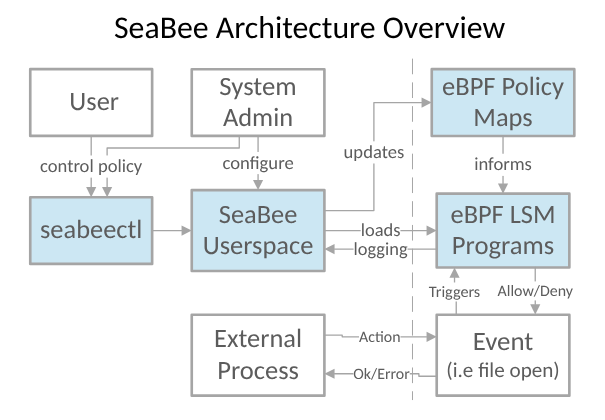

# SeaBee

SeaBee is a stylized acronym for "Security Enhanced Architecture for eBPF".

SeaBee is a framework for hardening other eBPF security tools against
intervention by privileged users.
For example, eBPF maps can be written to by any privileged user which
might make it easy to disrupt security policy or configuration of an eBPF security tool.
SeaBee allows an administrator to enforce policies controlling who has
access to eBPF tools on a system based on private keys.
This makes it harder for an attacker to compromise
or subvert security controls implemented in eBPF.

For an overview, see our [presentation about SeaBee](https://www.youtube.com/watch?v=4bWpTKK7Mlw) from the 2025 Linux Security Summit NA

To try out SeaBee, see [Getting Started with SeaBee](https://code.nsa.gov/seabee/getting_started/). Then try our [tutorial](https://code.nsa.gov/seabee/tutorial/).

Don't hesitate to create an issue or a PR. See [CONTRIBUTING.md](./CONTRIBUTING.md)

Please Note: this project is still under active development.
Policy language and apis may receive changes breaking backwards compatibility.

## Overview

The different elements of SeaBee are highlighted in blue.
The other elements show how users interact with SeaBee and
how other processes interact with SeaBee.

- `seabeectl` is a command line interface for SeaBee. See [`seabeectl` docs](https://code.nsa.gov/seabee/seabeectl/)
- The SeaBee userspace manages loading eBPF, tracking [policy](https://code.nsa.gov/seabee/policy/) updates,
and [logging](https://code.nsa.gov/seabee/logging/).
- eBPF maps are used to store SeaBee policy in the kernel
- eBPF LSM programs are used to enforce SeaBee policies on processes
when they take a particular action that SeaBee cares about.
Examples include accessing eBPF maps or files associated with a SeaBee policy.

## Use Cases

- Protect eBPF Security tools from privileged users
- Enforce isolation between distinct eBPF tools
- Visibility & auditing of modification or tampering with eBPF tools

## Documentation

Documentation is found under `docs/docs/` and is hosted at [code.nsa.gov/seabee](https://code.nsa.gov/seabee).

To build and view the documentation locally in a browser:

- `make update`
- `make -C docs serve-build`

## Disclaimer of Endorsement

Nothing in this Work is intended to constitute an endorsement, explicit or implied,
by the United States Government of any particular manufacturer's product or service.

Any reference made herein by the United States Government to any specific commercial
product, process, or service by trade name, trademark, manufacturer, or otherwise,
in this Work does not constitute an endorsement, recommendation, or favoring by the
United States Government and shall not be construed as a reference for advertising
or product endorsement purposes.
