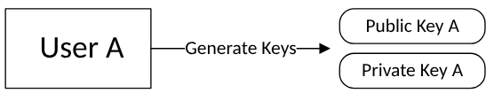
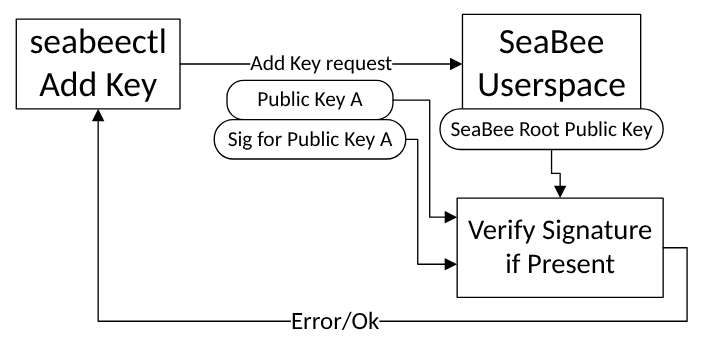
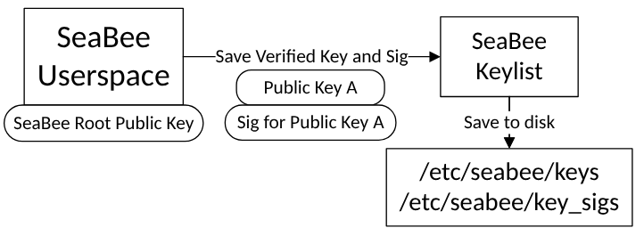
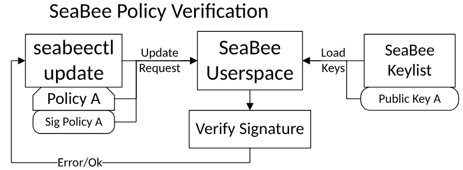
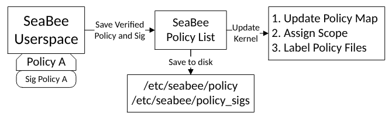
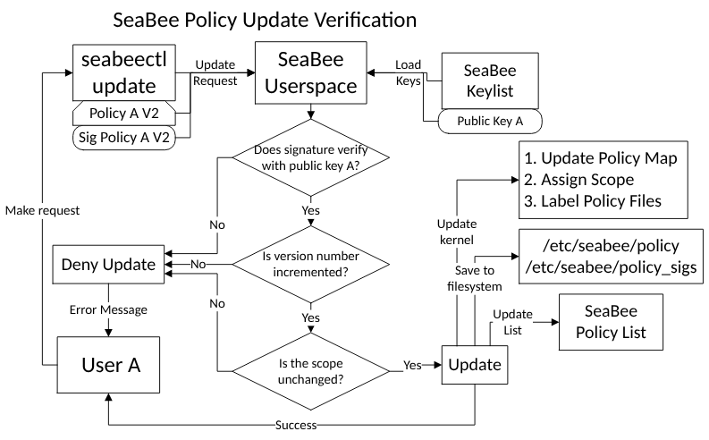

# Cryptography in SeaBee

This document explains how SeaBee uses cryptography in order to securely manage policy.
It assumes you are running SeaBee with `-v` or `--verify-policy` option enabled.
This option is enabled by default and is the only secure way to use SeaBee. This option enables
signature verification on SeaBee policies, ensuring the authenticity and integrity of requests
to update SeaBee policy. If this option is turned off, SeaBee provides no security guarantees,
but will still verify signatures and report (but not block) on failure.

## Public Key Cryptography for Digital Signatures

SeaBee relies on [public key cryptography](https://en.wikipedia.org/wiki/Public-key_cryptography) for [digital signatures](https://en.wikipedia.org/wiki/Digital_signature).
This section provides a short overview of using public key cryptography for digital signatures.
Public key cryptography is a system in which there are two keys: a public key and a private key.
The public key is visible to anyone and the private key must be kept secret.
If Alice wants to send Bob a secret message in this system, Alice would encrypt her message
using Bob's public key. Then Bob can decrypt Alice's message using his private key.
Since Bob is the only one with access to his private key, only he can decrypt the message, and it remains secret.

For digital signatures, we have a different goal.
Alice doesn't need her message to be secret, but she wants to prove to Bob:

1. She (Alice) authored the message (Authenticity)
1. The message received is the same as the message sent (Integrity)

First, Alice will create a unique message digest using a secure cryptographic hashing function
like [SHA-2](https://en.wikipedia.org/wiki/SHA-2) or [SHA-3](https://en.wikipedia.org/wiki/SHA-3).
Next, Alice will encrypt the message digest using her private key.
Alice then sends the message and the encrypted digest to Bob.
Bob is able to decrypt the message digest using Alice's public key.
Then Bob can recalculate the digest for the message and verify that it matches
Alice's encrypted digest.

Notice that unlike the first scenario, in this system, the private key is used for encryption
and the public key is used for decryption.
Since Alice's public key is used to decrypt the message,
Bob is confident that only Alice's private key could have encrypted the message.
Since Alice is the only person in possession of her private key,
Bob has achieved goal 1 and authenticated that the message came from Alice.
Since the encrypted digest matches the actual digest, we have proven
goal 2: that the message integrity was not compromised.

This is exactly how SeaBee verifies the authenticity and integrity of
SeaBee Policies. For the rest of this document, we will refer to the
encrypted message digest as a "digital signature".
The private encryption key is known as the "signing key", and the public
decryption key will be known as the "verification key".

## SeaBee Verification Keys

SeaBee uses digital signatures to verify policy updates.

In order to verify these signatures, verification keys must be added to
SeaBee before policy updates can be made.

A user must first generate a public private key pair.
SeaBee currently supports RSA and ECDSA digital signatures
and message digests using either SHA-2 or SHA-3. See [Issue 42](https://github.com/NationalSecurityAgency/seabee/issues/42)
for updates about support for PQC Algorithms.

Next, a user must add the key to SeaBee's key list.
This is done using `seabeectl add-key`.
You can see the help menu for any `seabeectl` command using `--help`.
`seabeectl` is a client for interacting with SeaBee and is explained more fully in its [documentation](./seabeectl.md)

By default, SeaBee allows any (privileged) user to add a key.
However, if the `verify-keys` option is specified in the [SeaBee config](./config.md),
then all new keys must be signed by the SeaBee root key.
This allows a system administrator to control who is able to use SeaBee.
Even if this option is false, a system administrator is always able to use
the root key to revoke another SeaBee key. This option defaults to false
to make SeaBee easier to use without making it any less secure.

The SeaBee root key will be explained more in the next section.

The SeaBee daemon performs signature verification on the key if the `verify-keys` option is specified.

Finally, the key is added to SeaBee's key list and saved to the filesystem
in folder protected by SeaBee.

If the system is rebooted, SeaBee will re-load keys and revalidate their signatures from these folders.
This ensures that a key will only need to be added once.

## SeaBee Root Key

SeaBee will requires an initial public verification key on startup.
This verification key is known as the "root key" because it is used to
control the administration of SeaBee.

The SeaBee root key can also be used like any other SeaBee key to add, update, or remove policies.
However, the SeaBee root key additionally has the following unique roles:

1. Used to verify signatures for newly added keys if `verify-keys` is enabled
1. Used to shutdown or turn off SeaBee with `seabeectl shutdown`
1. Can be used to revoke any SeaBee key with `seabeectl remove-key`

The SeaBee root public key is stored at `/etc/seabee/seabee_root_key.pem`.
SeaBee prevents the root key from being updated while SeaBee is running.
This means SeaBee must be turned off to modify the root key.
This remains true even if `verify-keys` is disabled.

Instructions for setting up the root key (requires openssl installed on the system: `openssl version` to check)

- Use `make gen-root-key` to generate an encrypted RSA key pair for SeaBee
- Use `make install-root-key` to copy the resulting public key to `/etc/seabee/seabee_root_key.pem`

## Key Management

Key management refers to how keys are created, stored, distributed,used, and destroyed.
Key management is a hard and complex problem, but it is critical for security.

SeaBee needs trustworthy key management to provide any meaningful security.
This is because SeaBee is moving trust away from privileged users and on to
cryptographic keys. The compromise of those keys is a compromise of SeaBee.

SeaBee keys should be kept secure using existing key management infrastructure.
If no such infrastructure exists. Here are some basic principles for securing SeaBee keys.

- All SeaBee private keys and especially the SeaBee root private key should be encrypted
- SeaBee private keys should not be stored on the production systems where SeaBee is running. They should ideally be stored on a separate secure system or hardware security module (HSM).
- SeaBee keys should be revoked and deleted when they are no longer needed
- SeaBee shutdown requests should be deleted after they are used since an
attacker would be able to re-use an already signed request that is left on a
system to turn off SeaBee.

## Signed Policy Updates

Now that we understand how SeaBee uses keys. We can start signing
and updating SeaBee policy to secure applications.
For information about how policies are structured, see [policy docs](./policy.md).
For an example of creating your own policy, see [policy tutorial](./policy_tutorial.md).

When a policy is first added, a digital signature must also be included as a
separate file. Recall that this digital signature is an encrypted digest
or hash of the policy. You can generate signatures with `seabeectl sign`
or a cryptographic library. You can check which algorithms are supported
with `seabeectl alg`.

The SeaBee userspace with verify the signature before applying the policy.

After the policy is loaded, the kernel eBPF data structures are
updated to reflect the new policy at which point the policy will be enforced.
Then the policy and signature are saved to the filesystem.
When the system reboots, all previously added policies will be reloaded
and reverified after the previously loaded keys are reloaded and reverified.

Later, when a policy needs to be updated, the new version policy must
include an updated signature that is generated using the _same key_.
This ensures that only a user with access to a private signing key
should be able to update the SeaBee policy.

Additionally, the version number on the policy must be increased.
This prevents accidental policy updates.
It also forces policy removals to specify a version of policy to be removed,
as opposed to being valid for every policy with a particular name.
Versioning policies is also best practice.

Finally, the scope cannot be changed on a policy update.
Changing the policy scope requires creating a new policy.

Observe that a hypothetical "User B" who adds a "Public Key B" would not be
able to update Policy A because policy A was originally signed by Public Key A.

## `seabeectl`

All updates will happen through the trusted binary `seabeectl`.
For more information, try `seabeectl --help`, our [seabeectl docs](./seabeectl.md) or do the [tutorial](./tutorial.md).

## Generating a key pair

In production, keys should be generated on a separate system from where SeaBee is deployed.

This tutorial uses `openssl` to generate keys.
SeaBee accepts RSA or ECDSA keys and expects password protected .pem files.

The following instructions are from the [openssl wiki](https://wiki.openssl.org/index.php/Command_Line_Utilities).

generate an RSA private key with passphrase

- `openssl genpkey -aes256 -algorithm RSA -pkeyopt rsa_keygen_bits:2048 -out rsa-private-key.pem`

generate an RSA public key

- `openssl pkey -in rsa-private-key.pem -out rsa-public-key.pem -pubout`

generate an ECDSA private key with passphrase using NIST curve `P-256`. See [NIST Recommendations](https://nvlpubs.nist.gov/nistpubs/SpecialPublications/NIST.SP.800-186.pdf) for ECDSA curves.

- `openssl genpkey -aes256 -algorithm EC -pkeyopt ec_paramgen_curve:P-256 -out ecdsa-private-key.pem`

generate an ECDSA public key

- `openssl pkey -in ecdsa-private-key.pem -out ecdsa-public-key.pem -pubout`

## Installing the SeaBee Root Key

This step must be done before starting up SeaBee or it will generate an error.

`sudo cp ecdsa-public-key.pem /etc/seabee/seabee_root_key.pem`

## Signing a SeaBee Policy

`seabeectl` has a utility for signing SeaBee policies, but it is also possible to use `openssl`.
We will use the ECDSA key from the previous section to do signing. By default, SeaBee expects
the message digest to be `sha3-256`, but any `SHA2` or `SHA3` can be used by specifying it in the policy file
or on the command line using `seabeectl sign -d`

Using `seabeectl`

- `sudo seabeectl sign -t test_policy.yaml -k ecdsa-private-key.pem -o signature.sign`

Using `openssl`

- `openssl dgst -sha3-256 -sign ecdsa-private-key.pem -out signature.sign test_policy.yaml`

## Verifying a SeaBee Policy

SeaBee will verify policies before they are loaded for the first time and whenever SeaBee receives a policy update.
SeaBee will try to verify an update with each of its verification keys (recall that SeaBee is initialized with a
root verification key and additional verification keys can be added).
If all of SeaBee's keys fail to verify a policy update,
then the update will be rejected.
By default, SeaBee expects signatures to use a `sha3-256` message digest,
but if the policy specifies another digest algorithm, then that algorithm will be used if SeaBee supports it.

Using `openssl` to test verification of policy signatures

- `openssl dgst -sha3-256 -verify ecdsa-public-key.pem -signature signature.sign test_policy.yaml`

Using `seabeectl` to test verification of policy signatures

- `sudo seabeectl verify -t test_policy.yaml -k ecdsa-public-key.pem -s signature.sign`
