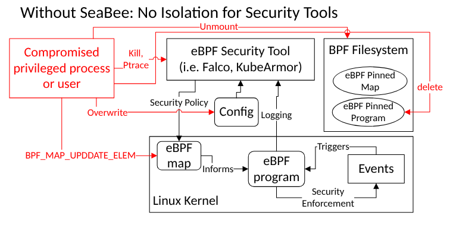
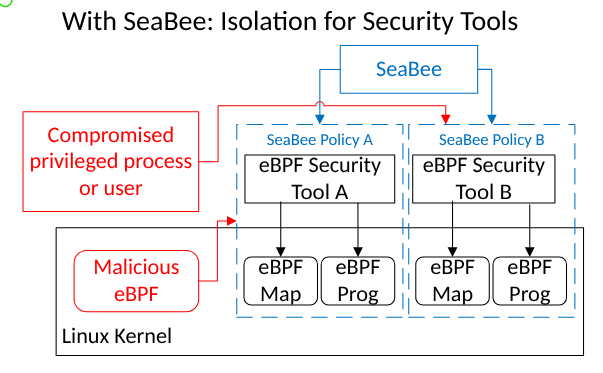
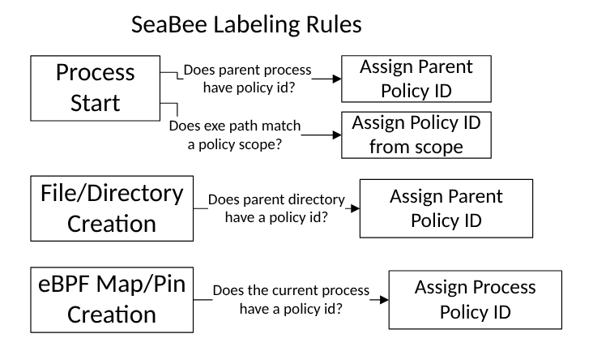
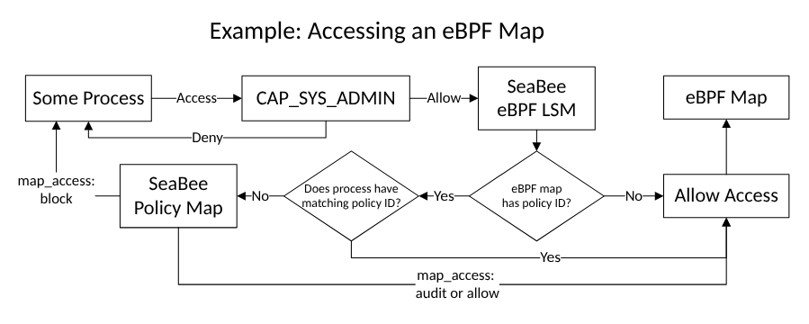

# SeaBee Policy

This document is intended to provide an overview and in-depth explanations
of how SeaBee policies work.

## Policy Overview

- SeaBee provides isolation for eBPF applications via policy
- Policy is defined for an executable or a set of executables (the policy scope)
- SeaBee detects when protected objects (e.g. eBPF maps) are created by a process in the policy
scope and assigns them with the corresponding policy ID including the process itself
- Any executable or process will have access to all protected objects with the same
Policy ID as itself, which indicates that it falls within the same scope.
- A SeaBee policy for an executable must be loaded before that executable starts in order
for SeaBee to associate the path of the executable with the created process and protect eBPF
objects for that process. When run as a systemd daemon(strongly recommended), SeaBee
must start before other daemon applications during boot in order to protect them.
If an application using SeaBee starts early during boot, it must ensure that it starts after SeaBee
(or add SeaBee as a dependency).





## Definitions

- Protected Object: anything that SeaBee protects including: processes, eBPF maps, pinned
programs, files, and directories.
- Policy ID: Each policy is assigned a Policy ID. The Policy ID is used to identify
protected objects associated with the same policy. All objects in the same policy have
the same Policy ID.
- Action: SeaBee supports three actions: allow, audit, and block.
Actions are defined in the policy config.
Actions determine how external processes can interact with protected objects under a policy.
The action can be different for each protected object.
For example: "map_access: audit" would audit,
but allow any external process to access a map that is within the policy scope.

## Sample Policy

Here is a sample annotated SeaBee policy. The rest of this document will walk through each part of the policy.
At the end, there is a discussion of the limitations of SeaBee policies.

More example policies can be seen at `tests/policies`

```yaml
# names must be unique
name: sample-policy
# version should be incremented on policy update
version: 1
scope:
  # this executable and all processes it creates are in scope
  - /usr/sbin/my-ebpf-tool
files:
  # all files created in this folder will be protected according to the "file_write_access" rule
  - /etc/my-ebpf-tool/
config:
  # block external access to maps created by a process in scope
  map_access: block
  # block external access to files listed in "files:"
  file_write_access: block
  # block access to eBPF pins in addition to "files:"
  include_pins: true
  # audit, but allow signals not specified in allow_mask
  signals: audit
  # since no signals are specified, all signals will be audited or blocked
  signal_allow_mask: 0x0
  # any options not included in config will be left to a secure default, usually blocking
```

## Policy Anatomy

This section gives a more detailed overview of each part of a policy.

### Name

The name of the policy is used to uniquely identify a policy.
If you try to add a policy with the same name as an existing policy,
SeaBee will interpret it as an attempt to update the existing policy.
This will mostly likely result in an error, or overwriting the old
policy if your new policy uses the same key and a higher version number.

### Version

The version should be incremented when a policy is updated.
The version ensures that an attacker cannot downgrade the policy to an old version
or maliciously update a policy.

### Scope

A list of paths to executables. These paths are used to determine what is
protected by a SeaBee policy. All child process will be in scope.
All eBPF maps or pins are in scope as well. Files created in a
protected directory are in scope as well as files or directories
specified in the policy.

If paths are scopes are symbolic links to binaries, it will not work correctly.
Seabee will not follow symbolic links.
This is an open issue and can be see at [Issue 12](https://github.com/NationalSecurityAgency/seabee/issues/12).

SeaBee implements a scope by storing the policy ID for each protected object.
Currently each object can only have one policy ID assigned to it.
This limits policy flexibility since two different policies cannot have overlapping scopes.
This is being addressed in [issue 34](https://github.com/NationalSecurityAgency/seabee/issues/34).
Assigning a policy ID to an object is sometimes referred to as
"Labeling". The following diagram shows the basic runtime labeling rules for SeaBee.



### Files

This section determines which files are protected by the policy.
It may be the case that there are repeated files between `scope` and `files`.
This would be the case if you wanted to prevent an executable from being modified
_and_ have that executable and its children in scope.

The paths listed in this section can include directories, files, and some other types of linux directory entries.
For each entry SeaBee will attempt to label the underlying inode.
These labels are used to enforce security controls. If the entry is a directory,
SeaBee uses the [`walkdir`](https://docs.rs/walkdir/latest/walkdir/) crate to recursively iterate through
all subdirectories and label everything in those directories as well.
This directory walk will not follow symlinks.

All of paths you specify must exist when the policy is loaded.
If one of your files does not exist on policy load, then SeaBee will generate an error.
In order to protect files that are created at runtime, the current approach is to
specify a directory and all files/directories created in that directory at runtime will
be protected. If support for protecting files at runtime is important to you, leave a comment
on our GitHub letting us know: [Issue 35](https://github.com/NationalSecurityAgency/seabee/issues/35).

### Config

The policy config determines what protections this policy provides to processes and objects created within the `scope`.
If an option is not specified in the policy it will default to block,
unless otherwise specified.

config has the following keys:

- `map_access`: control access to eBPF maps within the scope (allow, audit, block)
- `file_write_access`: control write access to the files listed in `files` section (allow, audit, block)
- `include_pins`: should eBPF pins be protected in addition to `files`? If true, all eBPF pins created within
scope will be protected according to the `file_write_access` level (true, false)
- `ptrace_access`: control if ptrace can be used on processes in scope (allow, audit, block)
- `signal_access`: control how to enforce the sigmask (allow, audit, block)
- `signal_allow_mask`: determines which signals should be allowed (see below)
  - default is `0x8430000` (see below for details)

### Sigmask

The sigmask requires further explanation. The sigmask allows a user to precisely control which signals are allowed
to be sent to a process within scope. To construct a sigmask, you need to first enumerate the codes for each signal
you want to allow. For example, if you want to allow SIGINT, you should get code 2.

The sigmask is a `u64` so it covers all possible signals including RT signals 32 through 64.
The null signal is not part of the standard signal set and therefore cannot be blocked
We construct the sigmask by taking the code for each signal we want to block, subtracting 1,
and flipping that bit to a 1 `(1<<(CODE-1))`. For SIGINT, we do `(1<<(2-1))` and get `0x2`.

The `0x2` sigmask will allow SIGINT but block all other signals to the process (if `signals` is set to `block`)

Setting `signals: allow` will cause the sigmask to be ignored altogether.

Sigmask can be specified as a hex or a decimal in the policy

We use this sigmask by default for SeaBee: `0x8430000`. This allows all signals that don't kill the process by default.
We generate the sigmask with the following code (from `seabee/src/utils.rs`)

```Rust
/// Generates a [mask](https://en.wikipedia.org/wiki/Mask_(computing))
/// of allowed signals
pub const fn generate_sigmask(sigint: SecurityLevel) -> u64 {
    let mut sigmask: u64 = 0;
    // These signals are those that do not terminate a process by default
    sigmask |= 1 << (Signal::SIGCHLD as u64 - 1);
    sigmask |= 1 << (Signal::SIGCONT as u64 - 1);
    sigmask |= 1 << (Signal::SIGURG as u64 - 1);
    sigmask |= 1 << (Signal::SIGWINCH as u64 - 1);

    if is_sigint_allowed(sigint) {
        sigmask |= 1 << (Signal::SIGINT as u64 - 1);
    }
    sigmask
}
```

## Policy Flexibility and Limitations

Think of a SeaBee policy as a list of "deny" or "audit" rules. By default, everything is allowed
(this is the 'policy' if SeaBee is not being used).
When an executable is listed under the "scope" for a SeaBee policy,
it is allowed access to all protected object it creates.
The Policy Config determines how other processes, not in policy
scope, are allowed to access protected objects within a policy scope.

Here is an example of a process trying to access and eBPF Map with
SeaBee enabled.



When answering "Is some process allowed to access some object?", SeaBee considers two things:

1. Does the process have the same Policy ID (scope) as the object?
1. If not, does the policy config for the object's policy have an 'audit' or 'allow' action?
Since these actions grant access to an external process.

Actions in the Policy Config are only granular to the class of protected object not to each
particular object. This means that you cannot have one map that is 'audit' and a different map
that is 'block' for the same policy scope/executable.

Currently, an executable or a file can only have one SeaBee policy ID.
This limits what types of policies can be created since you cannot
have a shared tool defined in multiple policy scopes.
This may be addressed in the future through [issue 34](https://github.com/NationalSecurityAgency/seabee/issues/34).
