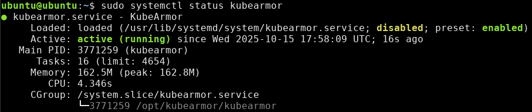
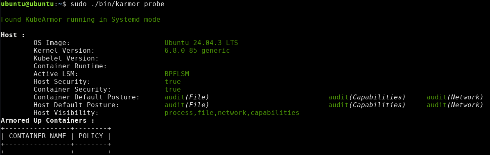
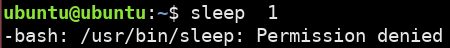
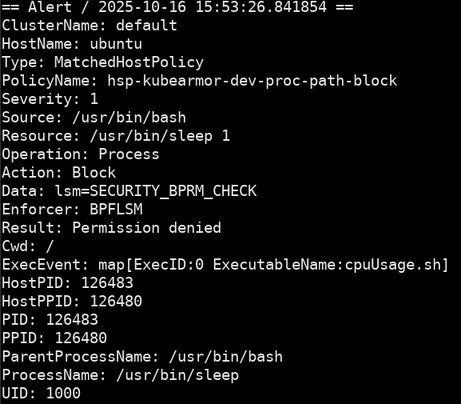
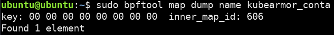
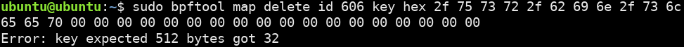
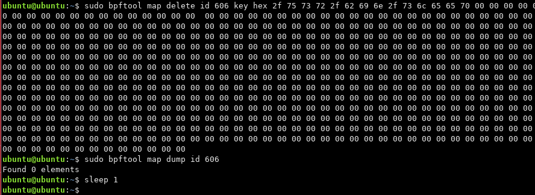
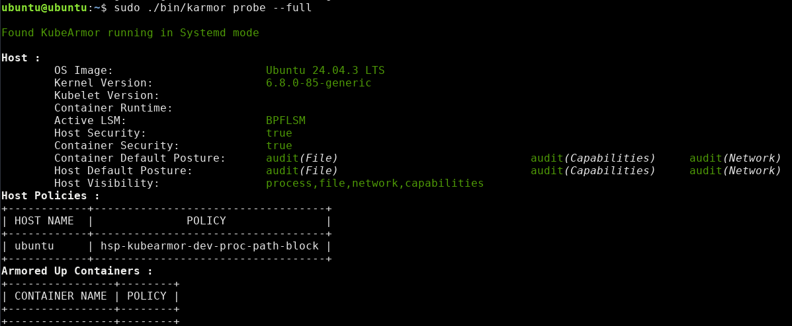
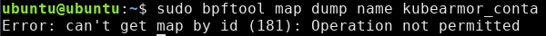
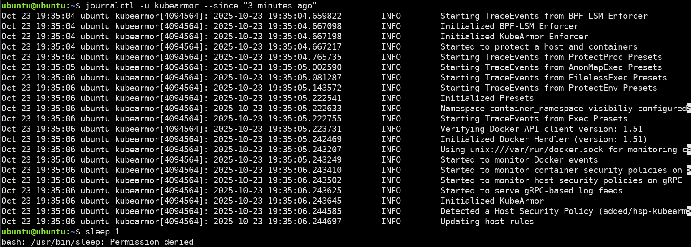

# Policy Tutorial

This is a guide for getting hands-on with SeaBee policy.

Section 3 assumes you have already gone through

- [Getting started with SeaBee](./getting_started.md)
- [SeaBee Tutorial](./tutorial.md)

If you're looking for documentation about the SeaBee policy, see [Policy Documentation](./policy.md). This documentation will also be a helpful reference throughout this tutorial.

## Sample Target Application: KubeArmor

[KubeArmor](https://github.com/kubearmor/KubeArmor/tree/main) is an open source eBPF security tool designed to protected Kubernetes workloads with security policies.
We've chosen to use this tool to demonstrate the process of developing a new SeaBee policy.

KubeArmor is a good candidate for this analysis because:

- It is open source, so our analysis can be replicated
- It has a healthy contributor community and many users that could benefit from a SeaBee policy
- Like SeaBee, it leverages the eBPF LSM for security enforcement

This is purely instructional and should not be construed as an endorsement of KubeArmor by the US Government, the Department of War, or the NSA.

## 1. Environment for Running KubeArmor

Tested using ubuntu 24.04 (noble) with bpf lsm enabled.

Followed [KubeArmor's instructions](https://docs.kubearmor.io/kubearmor/quick-links/kubearmor_vm) for vm deployment to avoid
the extra complexity from setting up k8s.

This tutorial was written with version KubeArmor 1.6.3, but you may want to use a more recent version.

Warning: we are about to download, install, and run binaries as root.
If you don't trust the authors of KubeArmor, it is highly recommended
to run these commands in a virtual machine or isolated environment.

- `wget https://github.com/kubearmor/KubeArmor/releases/download/v1.6.3/kubearmor_1.6.3_linux-amd64.deb`
- `sudo apt --no-install-recommends install ./kubearmor_1.6.3_linux-amd64.deb`
- `systemctl start kubearmor`
- `systemctl status kubearmor`



Now we need to install the `karmor` client using these [instructions](https://github.com/kubearmor/kubearmor-client/blob/main/README.md)

- install karmor client to `./bin/karmor`: `curl -sfL http://get.kubearmor.io/ | sh -s`
- check that `Active LSM:` is `BPFLSM` with `sudo ./bin/karmor probe`
  - BPF LSM is KubeArmor's default choice, if the enforcer is not BPF LSM, it is likely the OS does not support it.
  If you are running a modern Ubuntu, then BPF LSM is supported, but must be enabled. See [requirements](./requirements.md)



Now that KubeArmor is running, and the karmor client is installed, we will add a policy:  `vim hostpolicy.yaml`

```yaml
apiVersion: security.kubearmor.com/v1
kind: KubeArmorHostPolicy
metadata:
  name: hsp-kubearmor-dev-proc-path-block
spec:
  nodeSelector:
    matchLabels:
      kubearmor.io/hostname: "*" # Apply to all hosts
  process:
    matchPaths:
    - path: /usr/bin/sleep # try sleep 1
  action:
    Block
```

- add the policy:  `./bin/karmor vm policy add hostpolicy.yaml`
- test the policy with `sleep: 10`
  - If you are not blocked, then reload your shell and try again
- view the logs: `./bin/karmor logs --gRPC=:32767`



Great! This permission denied indicates that KubeArmor is working, lets demonstrate how SeaBee can improve the security.

## 2. Demonstrate The Value of SeaBee

### Goals

KubeArmor, and most eBPF tools, do not consider privileged users in their threat model.
The goal of SeaBee is to elevate the threat model of a tool to protect it from privileged users.
Privileged users can trivially defeat any protections put in place with eBPF LSM.
Let's see how that works with KubeArmor.

The goal of this exercise is to remove the KubeArmor policy we created without revealing to the
KubeArmor administrator that the policy has been removed. This would enable a privileged attacker to
undertake any action they want without being blocked or monitored by the security software on the
system, in this case: KubeArmor. At the same time, from the perspective the KubeArmor userspace and
system administrator, nothing will appear unusual.

The first step to accomplishing this is to understand how KubeArmor works.

- KubeArmor is using the eBPF LSM to enforce its security controls.
- In eBPF, all data is stored in eBPF maps. eBPF maps are just key-value stores.
- Some data from our policy must be stored in an eBPF map in order for KubeArmor to act on it (i.e. block 'sleep')
- Any privileged user can modify any eBPF map.

So this leaves us with several objectives

1. Which maps does KubeArmor use to store policy data for our policy?
1. How can we overwrite the data in that map?

### Understanding KubeArmor

The best way to answer question 1. is to go into the KubeArmor source code and work backwards.
Lets start by looking the at the log from when KubeArmor denied our use of 'sleep'.



This log has several useful pieces of information

- `"ProcessName":"/usr/bin/sleep"` shows this is the correct log
- `"Action":"Block"` indicates that we were blocked
- `"Enforcer":"BPFLSM"` shows that BPF LSM was used
- `lsm=SECURITY_BPRM_CHECK` indicates that the `security_bprm_check` LSM hook is being used to block this execution

Taking this information, we now go to the KubeArmor source code in search of the `security_bprm_check` enforcer code.

After a bit of intuitive searching, (alternatively use a fast search tool like `ripgrep`) we find the code at [KubeArmor/BPF/enforcer.bpf.c](https://github.com/kubearmor/KubeArmor/blob/main/KubeArmor/BPF/enforcer.bpf.c)

It's possible this code may have moved after this demo was written in October 2025. The relevant code looks like this:

```C
/* SPDX-License-Identifier: GPL-2.0    */
/* Copyright 2023 Authors of KubeArmor */
SEC("lsm/bprm_check_security")
int BPF_PROG(enforce_proc, struct linux_binprm *bprm, int ret) {
  struct task_struct *t = (struct task_struct *)bpf_get_current_task();
  event *task_info;
  int retval = ret;

  bool match = false;

  struct outer_key okey;
  get_outer_key(&okey, t);

  u32 *inner = bpf_map_lookup_elem(&kubearmor_containers, &okey);
// many more lines excluded
}
```

This shows that one of the first actions taken by this security hook is
performing a lookup in an eBPF map called `kubearmor_containers`.
We can find the definition for this map in a different file [shared.h](https://github.com/kubearmor/KubeArmor/blob/main/KubeArmor/BPF/shared.h).

Tip: you can navigate the codebase for KubeArmor and other tools much more
quickly by cloning them from github locally and using navigation tools build
in to modern IDEs such as VSCode C++ extensions. Generative AI can also be useful for searching a codebase.

```C
/* SPDX-License-Identifier: GPL-2.0 */
/* Copyright 2023 Authors of KubeArmor */
struct outer_hash {
  __uint(type, BPF_MAP_TYPE_HASH_OF_MAPS);
  __uint(max_entries, 256);
  __uint(key_size, sizeof(struct outer_key));
  __uint(value_size, sizeof(u32));
  __uint(pinning, LIBBPF_PIN_BY_NAME);
};

struct outer_hash kubearmor_containers SEC(".maps");
```

This map has type `BPF_MAP_TYPE_HASH_OF_MAPS`. Every eBPF map functions as a key-value store.
This map type means that the values are also eBPF Maps.

After exploring the code a little longer, several things become evident:

- the "outer key" used to access the `kubearmor_containers` map is derived from the current task (process)
- the `inner` value obtained from `kubearmor_containers` is used many times throughout the enforcement logic

We conclude that the `inner` value must store unique data for a process that helps to determine what enforcement
action should be taken. This is probably the data we want to overwrite.

### Overwriting KubeArmor Maps

In order to write data to an eBPF map, we will use `bpftool`.

This can easily be installed with `apt` or `dnf` or built [from source](https://github.com/libbpf/bpftool)

- `sudo apt install linux-tools-common linux-tools-generic linux-tools-$(uname -r)`
- `bpftool -V`

Using `bpftool` we can view all the maps on the system: `bpftool map list`

Here we can see the name and numeric id for each eBPF map. We are looking for the `kubearmor_containers` map.
Since eBPF maps have a limited name length, it appears are `kubearmor_conta`.


In order to view the map, we use `sudo bpftool map dump name kubearmor_conta`



This shows us that there is one entry, which we know is another eBPF map with id 606.

We can now dump the contents of this "inner" map with `bpftool` as well.


It looks like a long array with some bytes at the beginning. If we takes those bytes and interpret them as
ascii characters...

`2f 75 73 72 2f 62 69 6e 2f 73 6c 65 65 70` translates to `/usr/bin/sleep`.

Which is the path specified in our policy! This confirms that we have located the correct data.

Now we can just delete this data from the map with `bpftool`



Uh oh, it looks like we are going to need a lot more zeros.



Now that we removed that string from the map, the security to block `sleep` is no longer enforced.

Finally, from the perspective of the KubeArmor administrator, we observe that KubeArmor is still running
and our policy is still loaded. While it seems there is somewhat limited support for viewing loaded policies
in the vm mode, we can see our policy is still loaded with `./bin/karmor probe`.



### So What?

This demonstrates that any privileged user can make unauthorized, anonymous, and mostly invisible policy updates to system security policy with a single command.

Why be concerned about privileged users?

- It's not just privileged users, the same technique could be accomplished by any privileged process or daemon, or a container with privileges to use eBPF
- Insider threat may be a concern, even the actions of privileged users should be audited, especially when those actions are security-relevant

Is this a problem with other LSMs like AppArmor and SELinux?

- No
- Privileged users can modify the policy for AppArmor and SELinux, but they don't have arbitrary access to the internal data structures used by these tools
- `CAP_MAC_ADMIN` is needed to modify policy which is used less widely than `CAP_BPF`
- Updates to policy are always logged

What about tools besides KubeArmor?

- These problems are fundamental to eBPF and therefore affect almost every eBPF tool
- These same techniques can likely be used to disable security logging or network security policy in other tools

SeaBee exists to prevent any privileged user, process, daemon, or container from modifying or disabling security critical eBPF tools like KubeArmor.

## 3. Developing SeaBee Policy for KubeArmor

### Restoring KubeArmor State

In order to restore our KubeArmor policy so that is is enforcing again, we will remove and re-add it:

- `sudo ./bin/karmor vm policy delete hostpolicy.yaml`
- `sudo ./bin/karmor vm policy add hostpolicy.yaml`
- verify policy added with `sudo ./bin/karmor probe`
- `sleep 1` should return permission denied again

### Creating a naive SeaBee Policy

First we need to find the `kubearmor` binary we want to protect.
This is probably specified in the service file.
We can view the path of the service file by running `systemctl status kubearmor`.
For me, the service file is `/usr/lib/systemd/system/kubearmor.service`

```INI
[Unit]
Description=KubeArmor

[Service]
User=root
KillMode=process
WorkingDirectory=/opt/kubearmor/
ExecStart=/opt/kubearmor/kubearmor
Restart=always
RestartSec=10

[Install]
WantedBy=multi-user.target
```

The "ExecStart" tells us the KubeArmor binary is installed at `/opt/kubearmor/kubearmor`

Create the following simple SeaBee policy: `vim kubearmor-simple-seabee-policy.yaml`

```yaml
name: kubearmor-simple-seabee-policy
version: 1
scope:
  - /opt/kubearmor/kubearmor
files:
config: # leave as default
```

- Sign the policy: `sudo seabeectl sign -t kubearmor-simple-seabee-policy.yaml -k rsa-private-key.pem`
- Start up SeaBee: `systemctl start test_seabee`
- Add the policy: `sudo seabeectl update -t kubearmor-simple-seabee-policy.yaml -s signature.sign`

> Note: if this isn't working, you may need to create a key pair
> and add a public verification key to SeaBee.
> You can see how to do this in the [SeaBee tutorial](./tutorial.md)

Finally restart KubeArmor so the policy get applied: `systemctl restart kubearmor`

Lastly, test to see if we can manipulate KubeArmor's maps:

- `sudo bpftool map dump name kubearmor_conta`



We see that we have been denied. Among many protections, SeaBee tracks all eBPF maps created
by a protected process and prevents external access to them. Thus, SeaBee prevents the attack
we previously demonstrated. No more arbitrary access to the internal data structures of KubeArmor.

## 4. Tailoring a SeaBee Policy for a Tool

For this final part of the tutorial, we will take an in-depth look at
each component of SeaBee policy in order to construct a policy that is
more tailored for KubeArmor. By extension, this analysis should give
helpful considerations when crafting policy for any other tools with SeaBee.

If you haven't yet, reading the [policy documentation](./policy.md) will be very helpful.
We are going to walk through each part of a SeaBee policy and discuss how
to tailor that part of a policy for a tool.

We will start from our simple SeaBee policy for KubeArmor and expand it step by step.
Unfortunately, this process is very manual and is best completed by
a developer for the tool who understands how the tool works best.
Developing the policy for KubeArmor took hours of experimentation
and reading documentation. The final result may still be imperfect.

It is important to note that the SeaBee policy we create for KubeArmor
will only be relevant for the vm or host mode of KubeArmor.
When deploying KubeArmor on K8s as a DaemonSet,
there are different artifacts to protect, more
complexity and a different attack surface.

```yaml
name: kubearmor-simple-seabee-policy
version: 1
scope:
  - /opt/kubearmor/kubearmor
files:
config: # leave as default
```

### Config: signal_access and signal_allow_mask

Read about [signal access in SeaBee](./policy.md#sigmask)

We're going to start with signals because it will make it simpler
to test the other parts of the policy.
One of the current issues with out policy is that we block signals
to `kubearmor`. As a result, some functionality is broken, like
`systemctl stop kubearmor` which sends a SIGTERM(15) to the process.

You can see this by trying `systemctl stop kubearmor` while SeaBee
is running with out policy loaded.

SeaBee logs: `journalctl -u test_seabee -f`:

```text
Oct 23 17:58:41 ubuntu seabee[2785283]:  WARN SeaBee policy 2: task_kill: deny systemd(1) send SIGTERM(15) to kubearmor(2785562)
Oct 23 17:58:41 ubuntu seabee[2785283]:  WARN SeaBee policy 2: task_kill: deny systemd(1) send SIGKILL(9) to kubearmor(2785562)
Oct 23 17:58:41 ubuntu seabee[2785283]:  WARN SeaBee policy 2: task_kill: deny systemd(1) send SIGTERM(15) to kubearmor(2785562)
Oct 23 17:58:41 ubuntu seabee[2785283]:  WARN SeaBee policy 2: task_kill: deny systemd(1) send SIGKILL(9) to kubearmor(2785562)
```

systemd logs: `journalctl -u kubearmor -f`:

```text
Oct 23 17:58:41 ubuntu systemd[1]: kubearmor.service: Failed to kill main process 2785562 (kubearmor), ignoring: Operation not permitted
Oct 23 17:58:41 ubuntu systemd[1]: kubearmor.service: Killing process 2785562 (kubearmor) with signal SIGKILL.
Oct 23 17:58:41 ubuntu systemd[1]: kubearmor.service: Failed to kill main process 2785562 (kubearmor), ignoring: Operation not permitted
Oct 23 17:58:41 ubuntu systemd[1]: kubearmor.service: Failed to kill main process 2785562 (kubearmor), ignoring: Operation not permitted
Oct 23 17:58:41 ubuntu systemd[1]: kubearmor.service: Killing process 2785562 (kubearmor) with signal SIGKILL.
Oct 23 17:58:41 ubuntu systemd[1]: kubearmor.service: Failed to kill main process 2785562 (kubearmor), ignoring: Operation not permitted
Oct 23 17:58:41 ubuntu systemd[1]: kubearmor.service: Deactivated successfully.
Oct 23 17:58:41 ubuntu systemd[1]: kubearmor.service: Unit process 2785562 (kubearmor) remains running after unit stopped.
```

To prevent unexpected denials like this, lets audit signals to `kubearmor`
rather than block.
While this allows using signals to kill KubeArmor,
such actions will appear in SeaBee logs and also be shown on the process list (that `kubearmor` is no longer running)

```yaml
name: kubearmor-simple-seabee-policy
version: 2
scope:
  - /opt/kubearmor/kubearmor
files:
config:
  signal_access: audit
  signal_allow_mask: 0
```

- modify: `vim kubearmor-simple-seabee-policy.yaml`
- sign: `sudo seabeectl sign -t kubearmor-simple-seabee-policy.yaml -k rsa-private-key.pem`
- update: `sudo seabeectl update -t kubearmor-simple-seabee-policy.yaml -s signature.sign`

If you ran `systemctl stop kubearmor` while SeaBee was running,
then you will have to

- stop SeaBee: `systemctl stop test_seabee`
- kill KubeArmor: `sudo pkill kubearmor`
- restart SeaBee: `systemctl start test_seabee`
- restart KubeArmor: `systemctl start kubearmor`

Before continuing verify that

- seabee has our new policy with `sudo seabeectl list`
- kUbeArmor is running with `systemctl status kubearmor`


### Policy Scope

Read about [policy scope](./policy.md#policy-scope)

When creating a policy scope for a tool, there are several important considerations.

- the 'core' binary, i.e. `kubearmor` must be in scope
- any other binary that needs access to KubeArmor's files or eBPF structures must also be in scope
- The scope cannot be so broad that it causes unexpected permission
denials by protecting things that need to be available.
For example, systemd cannot be in scope.
- The scope generally should not include executables that belong
the system (ubuntu) rather than the tool (KubeArmor)

Then what executables should be in scope for KubeArmor?

We already have `/opt/kubearmor/kubearmor` in scope.
We will add `./bin/karmor` since it is used to manage KubeArmor policies.
However, we will need an absolute path for a SeaBee policy.
Lets copy the `karmor` client to `/usr/local/bin/karmor` which
should allow us to run it without modifying our PATH.

`sudo cp ./bin/karmor /usr/local/bin/karmor`

verify with `sudo karmor probe`

Now we have a new SeaBee policy scope:

```yaml
scope:
  - /opt/kubearmor/kubearmor
  - /usr/local/bin/karmor
```

We won't add anything else to the scope because it doesn't seem
like there are any other binaries that KubeArmor is using.

### Files

Read about [files in SeaBee](./policy.md#files)

For each file or directory we put in the SeaBee policy,
only the processes in scope will be able to write to them them.
This means that if a user or external needs to modify a file
for the tool to function,
that file and the directory it lives in should not be listed in
the SeaBee policy.

For KubeArmor, we will start by looking at different classes of files
that ought to be protected.

#### Policy files

`/opt/kubearmor/policies` contains the policy we created. You can
experiment by deleting this folder and restarting KubeArmor to see
that our policy is no longer loaded.
This folder should be protected.

#### Configuration file

`/opt/kubearmor/kubearmor.yaml` contains a configuration file.
Mine looks like this:

```yaml
cluster: "default"
gRPC: "32767"
hostVisibility: "process,file,network,capabilities"
enableKubeArmorHostPolicy: true
enableKubeArmorVm: false
k8s: false
alertThrottling: true
maxAlertPerSec: 10
throttleSec: 30
```

Noticing that `enableKubeArmorHostPolicy` is set to true,
I tried switching it to false and restarting KubeArmor.
I this causes KubeArmor to load, but no longer enforce policies.
However, this configuration change did appear in KubeArmor logs
both during startup and at runtime.

`journalctl -u kubearmor -f`

```text
Oct 23 18:24:09 ubuntu kubearmor[2786276]: 2025-10-23 18:24:09.784295        INFO        setting config from file [kubearmor.yaml]


Oct 23 18:24:09 ubuntu kubearmor[2786276]: 2025-10-23 18:24:09.784441        INFO        Configuration [{... Policy:false HostPolicy:false...}]
```

Given the security implications of this configuration file,
SeaBee should probably protect it.

#### Log files

KubeArmor logs exist in two places.

1. the journal, which is managed by systemd and does not need to be protected by SeaBee
1. the security events logs with that can be seen with `karmor logs --gRPC=:32767`
These logs are not stored by default, but can be configured to be stored on disk with `--logPath` option.

For our use case, we will not add a KubeArmor log path, so no
action is needed to protect KubeArmor log files.
However, if you were going to write logs to disk, it might make sense to
protect `/var/log/kubearmor/` or a similar location with SeaBee.

#### other files

I tried deleting `/opt/kubearmor/BPF` and KubeArmor failed to start.
This folder should be protected since KubeArmor relies on it.
Fixing this required re-installing KubeArmor.

I haven't look at `/opt/kubearmor/templates`, but
since everything else in `/opt/kubearmor/` seems important to KubeArmor,
se will protect the entire `/opt/kubearmor/` directory.

#### Updating our policy again

```yaml
name: kubearmor-simple-seabee-policy
version: 3
scope:
  - /opt/kubearmor/kubearmor
  - /usr/local/bin/karmor
files:
  - /opt/kubearmor
config:
  signal_access: audit
  signal_allow_mask: 0
```

- modify: `vim kubearmor-simple-seabee-policy.yaml`
- sign: `sudo seabeectl sign -t kubearmor-simple-seabee-policy.yaml -k rsa-private-key.pem`
- update: `sudo seabeectl update -t kubearmor-simple-seabee-policy.yaml -s signature.sign`

The final test of our policy is to verify that KubeArmor is still
functioning: `systemctl restart kubearmor`.

After checking `kubearmor` logs for errors, it seems to work.
I also observe that `sleep 1` is still blocked.



### Config: file_write_access

Read more about SeaBee [policy config](./policy.md#config)

This will remain as `block` which is currently the default.

### Config: include_pins

It is clear that KubeArmor crates eBPF pins by doing: `ls /sys/fs/bpf`.
However, it is unclear how these pins are used.

It is possible to delete these pins using `sudo rm /sys/fs/bpf/<pin_name>` if SeaBee is not running.
However, KubeArmor still works since these pinned maps still exist in kernel memory.
The pin is just a reference to the maps.

It is a good assumption that if KubeArmor creates these pins, it probably
relies on them to function correctly.

We will leave `include_pins` as the default, which is true.
This ensures the pins are protected by SeaBee.

### Config: map_access

This will remain as `block` which is currently the default.

This protection is critical to preventing the attack we demonstrated earlier.

### Config: ptrace_access

It is possible attach to `kubearmor` with `strace -p <pid>`.

This means that ptrace access is currently allowed.
Ptrace can be use maliciously to manipulate how the `kubearmor`
process works.

Since `ptrace` would only ever be needed for `kubearmor` for debugging,
we will keep it as `block`, which is the default

### Conclusions

Since the rest of the protections remain as the default,
we have completed our SeaBee policy for KubeArmor.

You can see this policy as `sample_policy/kubearmor-systemd.yaml`

```yaml
name: kubearmor-simple-seabee-policy
version: 3
scope:
  - /opt/kubearmor/kubearmor
  - /usr/local/bin/karmor
files:
  - /opt/kubearmor
config:
  signal_access: audit
  signal_allow_mask: 0
  # other options remain as default
```

## 5. Next Steps

Thats All!

If you have more questions about SeaBee, please reach out to us on
GitHub.

We always welcome issues, feature requests, and contributions.

```Shell
# cleanup
systemctl stop test_seabee
systemctl stop kubearmor

rm /usr/local/bin/karmor
rm hostpolicy.yaml
rm kubearmor-simple-seabee-policy.yaml
rm signature.sign
rm rsa-private-key.pem
rm rsa-public-key.pem

sudo apt remove kubearmor

sudo seabeectl clean policy
sudo seabeectl clean keys
```
