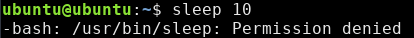
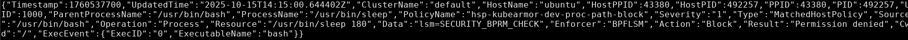
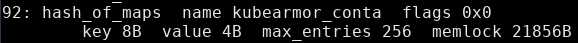
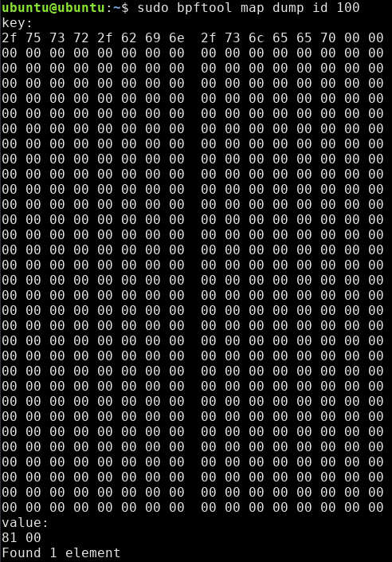
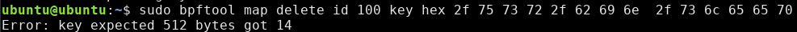
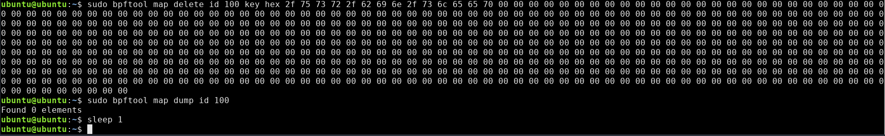

# Policy Tutorial

This is a guide for getting hands-on with SeaBee policy.

Section 3 assumes you have already gone through

- [Getting started with SeaBee](./getting_started.md)
- [SeaBee Tutorial](./tutorial.md)

If you're looking for documentation about the SeaBee policy, see [Policy Documentation](./policy.md). This documentation will also be a helpful reference throughout this tutorial.

## Sample Target Application: KubeArmor

[KubeArmor](https://github.com/kubearmor/KubeArmor/tree/main) is an open source eBPF security tool designed to protected Kubernetes workloads with security policies.
We've chosen to use this tool to demonstrate the process of developing a new SeaBee policy.

KubeArmor is a good candidate for this analysis because:

- It is open source, so our analysis can be replicated
- It has a healthy contributor community and many users that could benefit from a SeaBee policy
- Like SeaBee, it leverages the eBPF LSM for security enforcement

This is purely instructional and should not be construed as an endorsement of KubeArmor by the US Government, the Department of War, or the NSA.

## 1. Environment for Running KubeArmor

Tested using ubuntu 24.04 (noble) with bpf lsm enabled.

Followed [KubeArmor's instructions](https://docs.kubearmor.io/kubearmor/quick-links/kubearmor_vm) for vm deployment to avoid
the extra complexity from setting up k8s.

This tutorial was written with version KubeArmor 1.6.3, but you may want to use a more recent version

- `wget https://github.com/kubearmor/KubeArmor/releases/download/v1.6.3/kubearmor_1.6.3_linux-amd64.deb`
- `sudo apt --no-install-recommends install ./kubearmor_1.6.3_linux-amd64.deb`
- `sudo systemctl start kubearmor`
- `sudo systemctl status kubearmor`


Now we need to install the karmor client using these [instructions](https://github.com/kubearmor/kubearmor-client/blob/main/README.md)

- install karmor client to `./bin/karmor`: `curl -sfL http://get.kubearmor.io/ | sh -s`
- check that "Active LSM:" is "BPFLSM" with `sudo ./bin/karmor probe`
  - BPF LSM is kubearmor's default choice, if the enforcer is not BPF LSM, it is likely the OS does not support it.
  If you are running a modern Ubuntu, then BPF LSM is supported, but must be enabled. See [requirements](./requirements.md)


Now that kubearmor is running, and the karmor client is installed, we will add a policy:  `vim hostpolicy.yaml`

```yaml
apiVersion: security.kubearmor.com/v1
kind: KubeArmorHostPolicy
metadata:
  name: hsp-kubearmor-dev-proc-path-block
spec:
  nodeSelector:
    matchLabels:
      kubearmor.io/hostname: "*" # Apply to all hosts
  process:
    matchPaths:
    - path: /usr/bin/sleep # try sleep 1
  action:
    Block
```

- add the policy:  `./bin/karmor vm policy add hostpolicy.yaml`
- test the policy with `sleep: 10`
- view the logs: `./bin/karmor logs --gRPC=:32767 --json`



Great! This permission denied indicates that KubeArmor is working, lets demonstrate how SeaBee can improve the security.

## 2. Demonstrate The Value of SeaBee

### Goals

KubeArmor, and most eBPF tools, do not consider privileged users in their threat model.
The goal of SeaBee is to elevate the threat model of a tool to protect it from privileged users.
Privileged users can trivially defeat any protections put in place with eBPF LSM.
Let's see how that works with KubeArmor.

The goal of this exercise is to remove the KubeArmor policy we created without revealing to the
KubeArmor administrator that the policy has been removed. This would enable a privileged attacker to
undertake any action they want without being blocked or monitored by the security software on the
system, in this case: KubeArmor. At the same time, from the perspective the KubeArmor userspace and
system administrator, nothing will appear unusual.

The first step to acomplishing this is to understand how KubeArmor works.

- KubeArmor is using the eBPF LSM to enforce its security controls.
- In eBPF, all data is stored in eBPF maps. eBPF maps are just key-value stores.
- Some data from our policy must be stored in an eBPF map in order for KubeArmor to act on it (i.e. block 'sleep')
- Any privileged user can modify any eBPF map.

So this leaves us with several objectives

1. Which maps does KubeArmor use to store policy data for our policy?
1. How can we overwrite the data in that map?

### Understanding KubeArmor

The best way to answer question 1. is to go into the KubeArmor source code and work backwards.
Lets start by looking the at the log from when KubeArmor denied our use of 'sleep'.



This log has several useful peices of information

- `"ProcessName":"/usr/bin/sleep"` shows this is the correct log
- `"Action":"Block"` indicates that we were blocked
- `"Enforcer":"BPFLSM"` shows that BPF LSM was used
- `lsm=SECURITY_BPRM_CHECK` indicates that the `security_bprm_check` LSM hook is being used to block this execution

Taking this information, we now go to the KubeArmor source code in search of the `security_bprm_check` enforcer code.

After a bit of intuitive searching, we find the code at [KubeArmor/BPF/enforcer.bpf.c](https://github.com/kubearmor/KubeArmor/blob/main/KubeArmor/BPF/enforcer.bpf.c)

It's possible this code may have moved after this demo was written. The relevant code looks like this:

```C
/* SPDX-License-Identifier: GPL-2.0    */
/* Copyright 2023 Authors of KubeArmor */
SEC("lsm/bprm_check_security")
int BPF_PROG(enforce_proc, struct linux_binprm *bprm, int ret) {
  struct task_struct *t = (struct task_struct *)bpf_get_current_task();
  event *task_info;
  int retval = ret;

  bool match = false;

  struct outer_key okey;
  get_outer_key(&okey, t);

  u32 *inner = bpf_map_lookup_elem(&kubearmor_containers, &okey);
// many more lines excluded
}
```

The first action performed performing a lookup in an eBPF map called "kubeamor_containers".
We can find the definition for this map in a different file [shared.h](https://github.com/kubearmor/KubeArmor/blob/main/KubeArmor/BPF/shared.h)

```C
/* SPDX-License-Identifier: GPL-2.0 */
/* Copyright 2023 Authors of KubeArmor */
struct outer_hash {
  __uint(type, BPF_MAP_TYPE_HASH_OF_MAPS);
  __uint(max_entries, 256);
  __uint(key_size, sizeof(struct outer_key));
  __uint(value_size, sizeof(u32));
  __uint(pinning, LIBBPF_PIN_BY_NAME);
};

struct outer_hash kubearmor_containers SEC(".maps");
```

This map has type `BPF_MAP_TYPE_HASH_OF_MAPS`. Every eBPF map functions as a key-value store.
This map type means that the values are also eBPF Maps.

After exploring the code a little longer, several things become evident:

- the "outer key" used to access the `kubearmor_containers` map is derived from the current task (process)
- the `inner` value obtained from `kubearmor_containers` is used many times throughout the enforcement logic

We conclude that the `inner` value must store unique data for a process that helps to determine what enforcement
action should be taken. This is probably the data we want to overwrite.

### Overwriting KubeArmor Maps

In order to write data to an eBPF map, we will use `bpftool`.

This can easily be installed with `apt` or `dnf` or built [from source](https://github.com/libbpf/bpftool)

- `sudo apt install linux-tools-common linux-tools-generic linux-tools-$(uname -r)`
- `bpftool -V`

Using bpftool we can view all the maps on the system: `bpftool map list`

Here we can see the name and numeric id for each eBPF map. We are looking for the `kubearmor_containers` map.
Since eBPF maps have a limited name length, it appears are `kubearmor_conta`.



In order to view the map, we use `sudo bpftool map dump name kubearmor_conta`


This shows us that there is one entry, which we know is another eBPF map with id 100.

We can now dump the contents of this "inner" map with bpftool as well.



It looks like a long array with some bytes at the beginning. If we takes those bytes and interpret them as
ascii characters...

`2f 75 73 72 2f 62 69 6e 2f 73 6c 65 65 70` translates to `/usr/bin/sleep`.

Which is the path specified in our policy! This confirms that we have located the correct data.

Now we can just delete this data from the map with bpftool



Uh oh, it looks like we are going to need a lot more zeros.



Now that we removed that string from the map, the security to block `sleep` is no longer enforced.

Finally, from the perspective of the kubearmor administrator, we observe that KubeArmor is still running
and our policy is still loaded. While it seems there is somewhat limited support for viewing loaded policies
in the vm mode, we can see our policy is still loaded with `./bin/karmor probe`.


### So What?

This demonstrates that any privilged user can make unauthorized, anonymous, and mostly invisible policy updates to system security policy with a single command.

Why be concerned about privileged users?

- It's not just privileged users, the same technique could be acomplished by any privileged process or daemon, or a container with privileges to use eBPF
- Insider threat may be a concern, even the actions of privileged users should be logged

Is this a problem with other LSMs like AppArmor and SELinux?

- No
- Privileged users can modify the policy for AppArmor and SELinux, but they don't have arbitrary access to the internal data structures used by these tools
- `CAP_MAC_ADMIN` is needed to modify policy which is used less widely than `CAP_BPF`
- Updates to policy are always logged

What about tools besides KubeArmor?

- These problems are fundemental to the eBPF and therefore affect almost every eBPF tool
- These same techniques can likely be used to disable security logging or network security policy in other tools

SeaBee exists to prevent any privileged user, process, daemon, or container from modifying or disabling security critical eBPF tools like KubeArmor.

## 3. Developing SeaBee Policy for KubeArmor

### Restoring KubeArmor State

In order to restore our KubeArmor policy so that is is enforcing again, we will remove and re-add it:

- `sudo ./bin/karmor vm policy delete hostpolicy.yaml`
- `sudo ./bin/karmor vm policy add hostpolicy.yaml`
- verify policy added with `sudo ./bin/karmor probe`
- `sleep 1` should return permission denied again

### Creating a naive SeaBee Policy

First we need to find the kubearmor binary we want to protect.
This is probably specified in the service file.
We can view the service file by running `sudo systemctl status kubearmor`.
For me, the serivice file is `/usr/lib/systemd/system/kubearmor.service`

```INI
[Unit]
Description=KubeArmor

[Service]
User=root
KillMode=process
WorkingDirectory=/opt/kubearmor/
ExecStart=/opt/kubearmor/kubearmor
Restart=always
RestartSec=10

[Install]
WantedBy=multi-user.target
```

The "ExecStart" tells us the KubeArmor binary is installed at `/opt/kubearmor/kubearmor`

Create the following simple SeaBee policy: `vim kubearmor-simple-seabee-policy.yaml`

```yaml
name: kubearmor-simple-seabee-policy
version: 1
scope:
  - /opt/kubearmor/kubearmor
files:
config: # leave as default
```

- Sign the policy: `sudo seabeectl sign -t kubearmor-simple-seabee-policy.yaml -k rsa-private-key.pem`
- Start up SeaBee: `sudo systemctl start test_seabee`
- Add the policy: `sudo seabeectl update -t kubearmor-simple-seabee-policy.yaml -s signature.sign`

Finally restart kubearmor so the policy get applied: `sudo systemctl restart kubearmor`

Lastly, test to see if we can manipulate kubearmor's maps:

- `sudo bpftool map dump name kubearmor_conta`


We see that we have been denied. Among many protections, SeaBee tracks all eBPF maps created
by a protected process and prevents external access to them. Thus, SeaBee prevents the attack
we previously demonstrated. No more arbitrary access to the internal data structures of KubeArmor.

### More Complex SeaBee Policy

TODO
