# A Tutorial Using `seabeectl` to Interact with SeaBee

This tutorial  is intended to walk through the different features of
SeaBee and how they work. It should only take a few minutes.

This tutorial assumes you have already completed [getting started](./getting_started.md)

If you run into issues, see [troubleshooting](./troubleshooting.md)

## Starting up SeaBee

While seabee is running, we can use `seabeectl` to interact with it.
You can learn all about `seabeectl` in our [seabeectl documentation](./seabeectl.md).

If you've already run the SeaBee test cases, then the test daemon is already installed.
We will run the SeaBee test daemon and interact with it to see how SeaBee works.

- `systemctl start test_seabee` to start the daemon
- `systemctl status test_seabee` to make sure it is "active (running)"

Finally, if you want to see the `seabee` logs when it is running as a daemon, you can view them in the journal: `journalctl -u test_seabee -f`

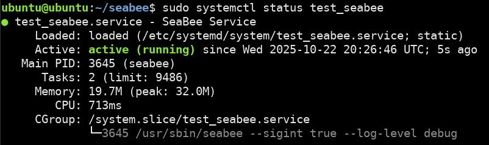

## SeaBee Policy

List any seabee policies with: `sudo seabeectl list`

We don't have any policies yet, so lets add one. Lets ask seabeectl for help: `sudo seabeectl --help`

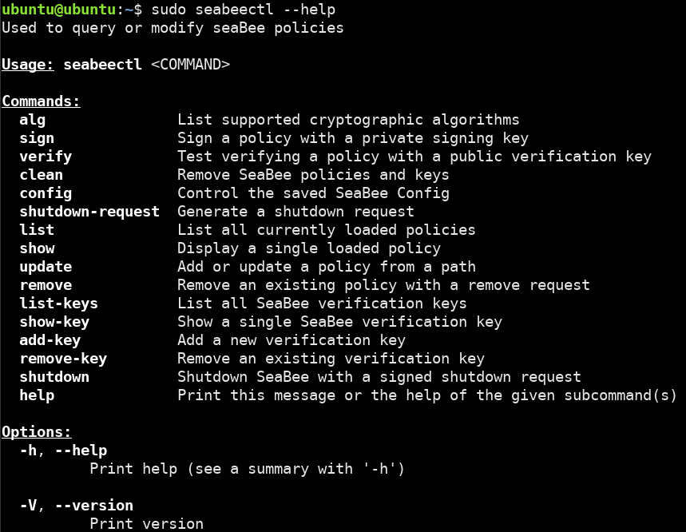

It looks like the command we need is called `update`. Lets find out more: `sudo seabeectl update --help`

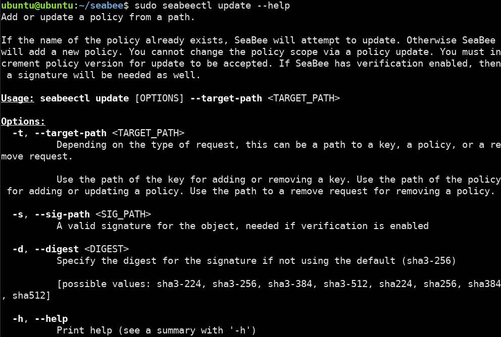

It looks like we need to give `seabeectl` a path to a policy file with
the `-t` option. You can learn more about creating SeaBee policies and
how they work in out [policy documentation](./policy.md).
For now, lets use a sample policy file:

view the policy: `cat tests/policies/sample_policy.yaml`

```yaml
---
name: sample-policy
version: 1
scope:
  - /usr/bin/vi
files:
  - /etc/test_seabee_policy
config:
  # audit access to eBPF maps in scope
  map_access: audit
  # block writes to files by out-of-scope processes
  file_write_access: block
  # block writes to eBPF pins in addition to other files
  include_pins: true
  # audit ptrace on /usr/bin/vi
  ptrace_access: audit
  # audit all signals to /usr/bin/vi
  signal_access: audit
  signal_allow_mask: 0x0
```

This file has come comments to help you understand what it does.
Normally policy files would target an eBPF application,
but for this tutorial we will use the `vi` editor for demonstration.

add the policy: `sudo seabeectl update -t tests/policies/sample_policy.yaml`

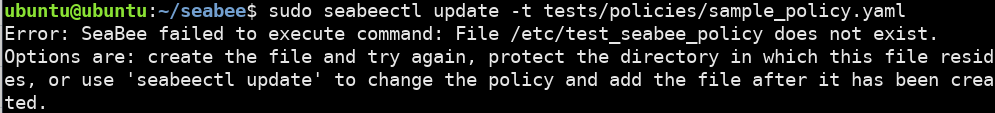

Uh Oh! It looks like we got an error because `/etc/test_seabee_policy` does not exist.
SeaBee policies apply protections to files on policy load.
This means that all files or directories specified in the policy
must exist when the policy is loaded.
Files created at runtime can be protected if they are created in a protected directory.
See [issue #35](https://github.com/NationalSecurityAgency/seabee/issues/35) for more.

Fortunately, the error message gives us some ideas for how to resolve this issue: `sudo mkdir /etc/test_seabee_policy`

Now try again: `sudo seabeectl update -t tests/policies/sample_policy.yaml`

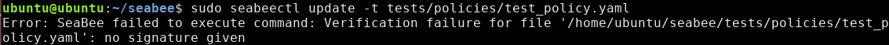

Looks like we got a verification failure because we didn't give a signature for our policy.
SeaBee uses signatures to authorize policies updates and removals.
This is how SeaBee moves trust away from privileged users and
instead towards cryptographic keys.

The next section looks into how to create keys and sign policies.

## Creating a Key

In order for SeaBee to accept a policy, it needs to
know the policy is authentic. This requires us to create a key and
tell SeaBee to trust it. To learn more about how the crypto works, read our [crypto documentation](./crypto.md).

`seabeectl` can tell us what kind of keys are supported: `sudo seabeectl alg`

We will use an RSA key for this tutorial.
Openssl is popular library for cryptography that we are going to use.
Start by checking that `openssl` is installed: `openssl version`

If it is not installed, you can install it with your package - manager.

- `sudo dnf install openssl openssl-devel` (Fedora/RHEL)
- `sudo apt-get install openssl libssl-dev` (Debian/Ubuntu)

Now we can create our RSA key pair:

- create private rsa key: `openssl genpkey -aes256 -algorithm RSA -pkeyopt rsa_keygen_bits:2048 -out rsa-private-key.pem`
- create corresponding public rsa key: `openssl pkey -in rsa-private-key.pem -out rsa-public-key.pem -pubout`

Remember that its important to encrypt private keys and even better:
generate, store, and use them on a separate secure system from where signature verification will take place.
For this tutorial, we are just learning and these keys don't need to be kept extra secure.

## Signing a Policy

Now lets use our new private key to sign our policy. While you can do this with openssl, `seabeectl` can do it too: `sudo seabeectl sign --help`

Use the `sign` command: `sudo seabeectl sign -t tests/policies/sample_policy.yaml -k rsa-private-key.pem`

Lets also check by using `seabeectl` to verify our signature

- `sudo seabeectl verify --help`
- `sudo seabeectl verify -t tests/policies/sample_policy.yaml -s signature.sign -k rsa-public-key.pem`

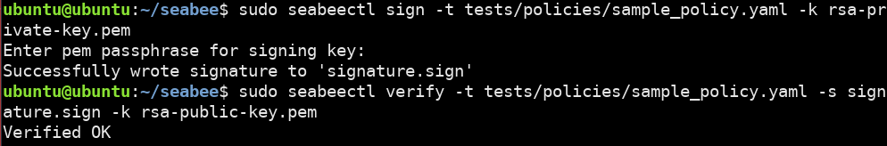

We have now successfully created a signature for our policy.

## Adding a Key to SeaBee

Before we add our policy, we still need SeaBee to trust our public key.
To see how that's done, ask `seabeectl` for help again:
`sudo seabeectl add-key --help`

SeaBee can allow anyone to add policies, or only those authorized by the administrator (`--verify-keys` configuration option).
By default, anyone can add a verification key. This doesn't really make SeaBee less secure, since you can't update policies signed by a key you don't have. It just makes it easier for users to add their own policies.

`sudo seabeectl add-key -t rsa-public-key.pem`

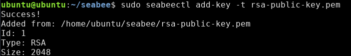

We can check that our key was added with `sudo seabeectl list-keys`. The key with ID 0 is the root key.

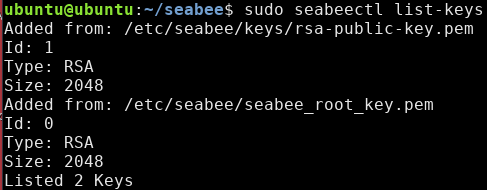

## Adding a SeaBee Policy

Now that we have a key added, we can finally add our SeaBee policy.

`sudo seabeectl update -t tests/policies/sample_policy.yaml -s signature.sign`

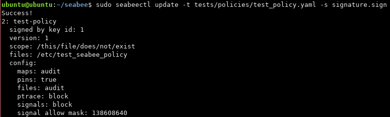

Success!

Lastly, we can check that our policy was added with `sudo seabeectl list`

## Testing a SeaBee Policy

In order to test that our policy works, we should take an action and see that it is denied.

Lets try to delete the directory we created: `sudo rmdir /etc/test_seabee_policy`

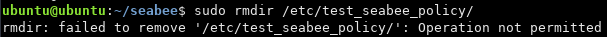

Permission denied indicates our policy is working.

Additionally, lets check the seabee logs to see the denial: `journalctl -u test_seabee -f`


At the `WARN` level, we see the denial of our attend to delete the
`test_seabee_policy` directory. The `DEBUG` logs also show some of
SeaBee's internal actions like labeling files and interacting with the kernel.

The default log level is configurable in SeaBee's [configuration](./config.md).

We can also test to see that an action is allowed.
Since we specified `/usr/bin/vi` in our policy scope,
lets try to open a file with `vi`.

`sudo vi /etc/test_seabee_policy/testfile.txt`

press `i` to enter insert mode, type some text, then press `Esc` and type `:wq` to save and exit.

Now print the file: `cat /etc/test_seabee_policy/testfile.txt`


This demonstrates how SeaBee policy can protect a process and its
files from being modified by an outside application.

## Creating a SeaBee Policy for your Application

Feel free to try out the sample `vi` policy more.

- try sending signals to `vi`
- try deleting the the test file
- try using `strace -p` to attach to `vi`
- try updating the policy

If you want to dive deeper into SeaBee policy,
There is a second tutorial for this purpose.

[SeaBee Policy Tutorial](./policy_tutorial.md)

## Removing a SeaBee Policy

In order to remove a policy, you also need a signed request. This prevents anyone from
removing a policy, rather, only the user who added a policy is able to remove it.

A "SeaBee Remove Request" is very simple and only includes the name and version of
the policy to remove. The version is important since it helps to prevent [replay attacks](https://en.wikipedia.org/wiki/Replay_attack).

`cat tests/policies/remove_sample_policy.yaml`

```yaml
---
name: sample-policy
version: 1
```

- sign remove request: `sudo seabeectl sign -t tests/policies/remove_sample_policy.yaml -k rsa-private-key.pem`
- find format for remove command: `sudo seabeectl remove --help`
- remove: `sudo seabeectl remove -t tests/policies/remove_sample_policy.yaml -s signature.sign`
- verify the removal: `sudo seabeectl list`

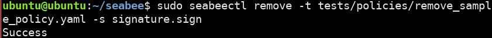

## Removing a SeaBee Key

Ask SeaBee to tell us how to remove a key: `sudo seabeectl remove-key --help`

Since we have verification enabled by default, a signature is needed. In this case, we need to sign
the public key with our private key. This is not resistant to replay attacks. In production,
once a key is removed, it should not be re-added, instead a new key should be created and added.

- `sudo seabeectl sign -t rsa-public-key.pem -k rsa-private-key.pem`
- `sudo seabeectl remove-key -t rsa-public-key.pem -s signature.sign`
- verify removal: `sudo seabeectl list-keys`

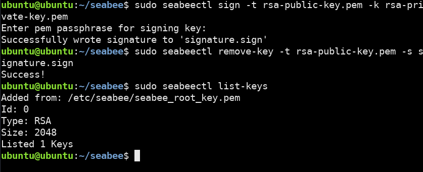

Now that we have removed our key, the only key left is the root key with ID 0.

## Shutdown SeaBee

Finally, we will use a shutdown command to exit SeaBee.

When you are running `test_seabee`, it is possible to turn off SeaBee
with `systemctl stop test_seabee`.
However, the when `seabee` is running in production, is it designed to
ignore signals and the `systemctl stop` command.
This is to prevent an attacker from disabling SeaBee.
`sudo seabeectl shutdown` requires a signature from the root key to
shutdown SeaBee.

To demonstrate how this works, first generate a shutdown request: `sudo seabeectl shutdown-request`.
This will create a file called `shutdown_request.yaml`.

`cat shutdown_request.yaml`

```yaml
machine_id: fffffffffffffffffffffffffffffff
```

The shutdown request contains a `machine_id` field that comes from `/etc/machine-id`.
This makes the request unique to this machine.

Next, sign the shutdown request: `sudo seabeectl sign -t shutdown_request.yaml -k seabee-root-private.pem`

Finally, issue the shutdown command: `sudo seabeectl shutdown -t shutdown_request.yaml -s signature.sign`

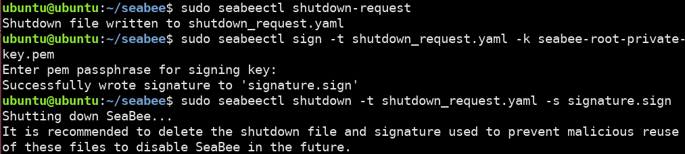

It is important that the shutdown request is deleted after it is used so that an attacker cannot
reuse the request to shutdown SeaBee again maliciously.

SeaBee shutdown requests are generally used rarely, such as upgrading SeaBee to a
new version.
If there is a problem with SeaBee it is safer to remove and re-add SeaBee policies rather
than shutting Seabee off altogether.

- `rm shutdown_request.yaml`
- `rm signature.sign`

## Conclusion

That is the end of this tutorial!

Next, try our follow-up tutorial about [creating policies](./policy_tutorial.md)

You may want to clean up the artifacts you made:

```Bash
rm rsa-private-key.pem
rm rsa-public-key.pem
rm signature.sign
```

## Commands reference

Here I've summarized all the commands from this tutorial roughly in order

```Bash
# Starting up SeaBee
systemctl start test_seabee
systemctl status test_seabee
journalctl -u test_seabee -f
sudo seabeectl --help

# List SeaBee policy
sudo seabeectl list
cat tests/policies/sample_policy.yaml

# Creating a key
sudo seabeectl alg
openssl genpkey -aes256 -algorithm RSA -pkeyopt rsa_keygen_bits:2048 -out rsa-private-key.pem
openssl pkey -in rsa-private-key.pem -out rsa-public-key.pem -pubout

# Signing a policy
sudo seabeectl sign -t tests/policies/sample_policy.yaml -k rsa-private-key.pem
sudo seabeectl verify -t tests/policies/sample_policy.yaml -s signature.sign -k rsa-public-key.pem

# Adding a key
sudo seabeectl add-key -t rsa-public-key.pem
sudo seabeectl list-keys

# Adding a policy
sudo seabeectl update -t tests/policies/sample_policy.yaml -s signature.sign
sudo seabeectl list

# Removing a policy
cat tests/policies/remove_sample_policy.yaml
sudo seabeectl sign -t tests/policies/remove_sample_policy.yaml -k rsa-private-key.pem
sudo seabeectl remove -t tests/policies/remove_sample_policy.yaml -s signature.sign
sudo seabeectl list

# Shutdown SeaBee
sudo seabeectl shutdown-request
sudo seabeectl sign -t shutdown_request.yaml -k seabee-root-private.pem
sudo seabeectl shutdown -t shutdown_request.yaml -s signature.sign

# Removing a key
sudo seabeectl sign -t rsa-public-key.pem -k rsa-private-key.pem
sudo seabeectl remove-key -t rsa-public-key.pem -s signature.sign
sudo seabeectl list-keys
```
