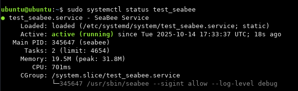
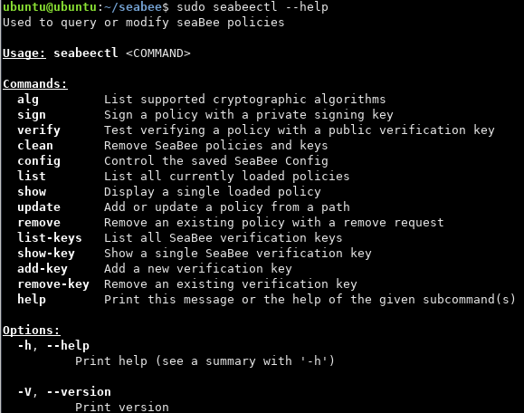
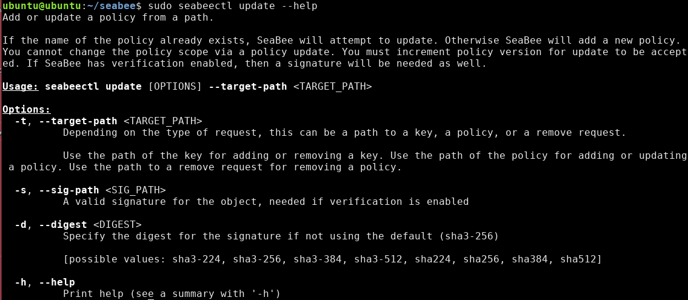

# A Tutorial Using `seabeectl` to Interact with SeaBee

This tutorial  is intended to walk through the different features of
SeaBee and how they work. It should only take a few minutes.

This tutorial assumes you have already completed [getting started](./getting_started.md)

If you run into issues, see [troubleshooting](./troubleshooting.md)

## Starting up SeaBee

While seabee is running, we can use `seabeectl` to interact with it.

If you've already run the SeaBee test cases, then the test daemon is already installed.
We will run the SeaBee test daemon and interact with it to see how SeaBee works.

* `sudo systemctl start test_seabee` to start the daemon
* `sudo systemctl status test_seabee` to make sure it is "active (running)"

Finally, if you want to see the `seabee` logs when it is running as a daemon, you can view them in the journal: `journalctl -u test_seabee -f`



## SeaBee Policy

List any seabee policies with: `sudo seabeectl list`

We don't have any policies yet, so lets add one. Lets ask seabeectl for help: `sudo seabeectl --help`



It looks like the command we need is called `update`. Lets find out more: `sudo seabeectl update --help`



It looks like we need to give `seabeectl` a path to a policy file with
the `-t` option. You can learn more about creating SeaBee policies and
how they work in out [policy documentation](./policy.md).
For now, lets use a sample policy file from our test cases:

* view the policy: `cat tests/policies/test_policy.yaml`
* add the policy: `sudo seabeectl update -t tests/policies/test_policy.yaml`


Uh Oh! We got a verification failure because we didn't give a signature
for our policy.

## Creating a Key

In order for SeaBee to accept a policy, it needs to
know the policy is authentic. This requires us to create a key and
tell SeaBee to trust it. To learn more about how the crypto works, read our [crypto documentation](./crypto.md).

`seabeectl` can tell us what kind of keys are supported: `sudo seabeectl alg`

* create a private rsa key with openssl: `openssl genpkey -aes256 -algorithm RSA -pkeyopt rsa_keygen_bits:2048 -out rsa-private-key.pem`
* create a corresponding public rsa key with openssl: `openssl pkey -in rsa-private-key.pem -out rsa-public-key.pem -pubout`

Remember that its important to encrypt private keys and even better:
generate, store, and use them on a separate secure system from where signature verification will take place.
For this tutorial, we are just learning and these keys don't need to be kept extra secure.

## Signing a Policy

Now lets use our new private key to sign our policy. While you can do this with openssl, `seabeectl` can do it too: `sudo seabeectl sign --help`

Use the `sign` command: `sudo seabeectl sign -t tests/policies/test_policy.yaml -k rsa-private-key.pem`

Lets also check by using `seabeectl` to verify our signature

* `sudo seabeectl verify --help`
* `sudo seabeectl verify -t tests/policies/test_policy.yaml -s signature.sign -k rsa-public-key.pem`

## Adding a Key to SeaBee

Before we add our policy, we still need SeaBee to trust our public key.
To see how that's done, ask `seabeectl` for help again:
`sudo seabeectl add-key --help`

SeaBee can allow anyone to add policies, or only those authorized by the administrator (`--verify-keys` configuration option).
By default, anyone can add a verification key. This doesn't really make SeaBee less secure, since you can't update policies signed by a key you don't have. It just makes it easier for users to add thier own policies.

`sudo seabeectl add-key -t rsa-public-key.pem`


We can check that our key was added with `sudo seabeectl list-keys`. The key with ID 0 is the root key.


## Adding a SeaBee Policy

Now that we have a key added, we can finally add our SeaBee policy.

`sudo seabeectl update -t tests/policies/test_policy.yaml -s signature.sign`


We got another error. This time because our policy refers to a directory `/etc/test_seabee_policy` which does not exist.
SeaBee policies apply protections to files on policy load. This means that all files or directories specified in the policy
must exist when the policy is loaded. Files created at runtime can be protected if they are created in a protected directory.
See [issue #35](https://github.com/NationalSecurityAgency/seabee/issues/35) for more.

Lets fix the error by creating the directory

* `sudo mkdir /etc/test_seabee_policy`
* `sudo seabeectl update -t tests/policies/test_policy.yaml -s signature.sign`


Success!

Lastly, lets check that our policy was added with `sudo seabeectl list`

## Testing a SeaBee Policy

In order to test that our policy works, we should take an action and see that it is denied.

Lets try to delete the directory we just created: `sudo rmdir /etc/test_seabee_policy`


Permission denied indicates our policy is working.

Additionally, lets check the seabee logs to see the denial: `journalctl -u test_seabee -f`


At the `WARN` level, we see the denial of our attend to delete the
`test_seabee_policy` directory. The `DEBUG` logs also show some of
SeaBee's internal actions like labeling files and interacting with the kernel.

The default log level is configurable in SeaBee's [configuration](./config.md).

## Creating a SeaBee Policy for your Application

This topic is a more advanced and we have a second tutorial for this purpose.

[SeaBee Policy Tutorial](./policy_tutorial.md)

## Removing a SeaBee Policy

In order to remove a policy, you also need a signed request. This prevents anyone from
removing a policy, rather, only the user who added a policy is able to remove it.

A "SeaBee Remove Request" is very simple and only includes the name and version of
the policy to remove. The version is important since it prevents [replay attacks](https://en.wikipedia.org/wiki/Replay_attack).

* `cat tests/policies/remove_test_policy.yaml`
* sign remove reqest: `sudo seabeectl sign -t tests/policies/remove_test_policy.yaml -k rsa-private-key.pem`
* find format for remove command: `sudo seabeectl remove --help`
* remove: `sudo seabeectl remove -t tests/policies/remove_test_policy.yaml -s signature.sign`
* verify the removal: `sudo seabeectl list`

## Removing a SeaBee Key

Ask SeaBee to tell us how to remove a key: `sudo seabeectl remove-key --help`

Since we have verification enabled by default, a signature is needed. In this case, we need to sign
the public key with our private key. This is not resistant to replay attacks. In production,
once a key is removed, it should not be re-added, instead a new key should be created and added.

* `sudo seabeectl sign -t rsa-public-key.pem -k rsa-private-key.pem`
* `sudo seabeectl remove-key -t rsa-public-key.pem -s signature.sign`
* verify removal: `sudo seabeectl list-keys`

## Conclusion

That is the end of this tutorial!

When you're done exploring SeaBee, turn off the test daemon: `sudo systemctl stop test_seabee`

Next, try our follow-up tutorial about [creating policies](./policy_tutorial.md)

You may want to clean up the artifacts you made:

```Bash
rm rsa-private-key.pem
rm rsa-public-key.pem
rm signature.sign
```

## Commands reference

Here I've summarized all the commands from this tutorial roughly in order

```Bash
# Starting up SeaBee
sudo systemctl start test_seabee
sudo systemctl status test_seabee
journalctl -u test_seabee -f
sudo seabeectl --help

# List SeaBee policy
sudo seabeectl list
cat tests/policies/test_policy.yaml

# Creating a key
sudo seabeectl alg
openssl genpkey -aes256 -algorithm RSA -pkeyopt rsa_keygen_bits:2048 -out rsa-private-key.pem
openssl pkey -in rsa-private-key.pem -out rsa-public-key.pem -pubout

# Signing a policy
sudo seabeectl sign -t tests/policies/test_policy.yaml -k rsa-private-key.pem
sudo seabeectl verify -t tests/policies/test_policy.yaml -s signature.sign -k rsa-public-key.pem

# Adding a key
sudo seabeectl add-key -t rsa-public-key.pem
sudo seabeectl list-keys

# Adding a policy
sudo seabeectl update -t tests/policies/test_policy.yaml -s signature.sign
sudo seabeectl list

# Removing a policy
cat tests/policies/remove_test_policy.yaml
sudo seabeectl sign -t tests/policies/remove_test_policy.yaml -k rsa-private-key.pem
sudo seabeectl remove -t tests/policies/remove_test_policy.yaml -s signature.sign
sudo seabeectl list

# Removing a key
sudo seabeectl sign -t rsa-public-key.pem -k rsa-private-key.pem
sudo seabeectl remove-key -t rsa-public-key.pem -s signature.sign
sudo seabeectl list-keys
```
